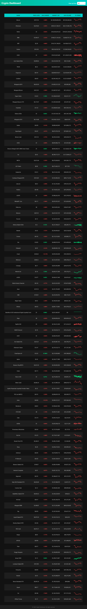

# Crypto Dashboard

A **modern, responsive cryptocurrency dashboard** that tracks real-time cryptocurrency prices and key metrics. It allows users to filter, search, and sort coins while viewing 7-day sparkline charts, all in a clean, dark-themed interface.  

---
## Screenshot



## Features

- Real-time cryptocurrency data using **CoinGecko API**
- **Price filter**: All / Below $1 / $1–$5 / $5–$10
- **Search by coin name**
- **Sortable columns**: Name, Price, 24h Change, Market Cap, 24h Volume
- **7-day sparkline charts** for each coin
- **Color-coded 24h change** (green = positive, red = negative)
- Fully **responsive** and mobile-friendly
- **Auto-refreshes every 60 seconds**
- SEO-friendly HTML structure

---

## Technologies Used

- **HTML5 & CSS3** – Semantic structure & responsive design
- **JavaScript (ES6)** – Data fetching, filtering, search, and sorting
- **Chart.js** – Sparkline charts
- **CoinGecko API** – Real-time crypto data

---

## Installation / Usage

1. Clone the repository:
```bash
git clone https://github.com/kikinjeri/crypto-price-tracker.git

Future Improvements

Add pagination or infinite scrolling for large coin lists

Add favorites/watchlist feature

Add detailed historical charts on coin click

Display top gainers and losers in highlighted colors

Light/Dark mode toggle


---

### ✅ Notes:

1. **Screenshot placeholder:**  
   - Path: `images/Screenshot.png`  
   - You can replace it with your actual screenshot.  

2. **Polished formatting:**  
   - Clear **sections**: Features, Technologies, Usage, Screenshot, Future Improvements, License  
   - SEO-friendly language  
   - Markdown best practices  

---
=======
# Crypto Dashboard

A **modern, responsive cryptocurrency dashboard** that tracks real-time cryptocurrency prices and key metrics. It allows users to filter, search, and sort coins while viewing 7-day sparkline charts, all in a clean, dark-themed interface.  

---

## Features

- Real-time cryptocurrency data using **CoinGecko API**
- **Price filter**: All / Below $1 / $1–$5 / $5–$10
- **Search by coin name**
- **Sortable columns**: Name, Price, 24h Change, Market Cap, 24h Volume
- **7-day sparkline charts** for each coin
- **Color-coded 24h change** (green = positive, red = negative)
- Fully **responsive** and mobile-friendly
- **Auto-refreshes every 60 seconds**
- SEO-friendly HTML structure

---

## Technologies Used

- **HTML5 & CSS3** – Semantic structure & responsive design
- **JavaScript (ES6)** – Data fetching, filtering, search, and sorting
- **Chart.js** – Sparkline charts
- **CoinGecko API** – Real-time crypto data

---

## Installation / Usage

1. Clone the repository:
```bash
git clone https://github.com/kikinjeri/crypto-dashboard.git

Future Improvements

Add pagination or infinite scrolling for large coin lists

Add favorites/watchlist feature

Add detailed historical charts on coin click

Display top gainers and losers in highlighted colors

Light/Dark mode toggle


---

### ✅ Notes:

1. **Screenshot placeholder:**  
   - Path: `images/Screenshot.png`  
   - You can replace it with your actual screenshot.  

2. **Polished formatting:**  
   - Clear **sections**: Features, Technologies, Usage, Screenshot, Future Improvements, License  
   - SEO-friendly language  
   - Markdown best practices  

---

